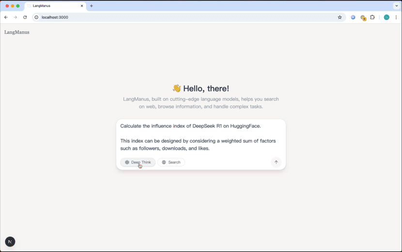
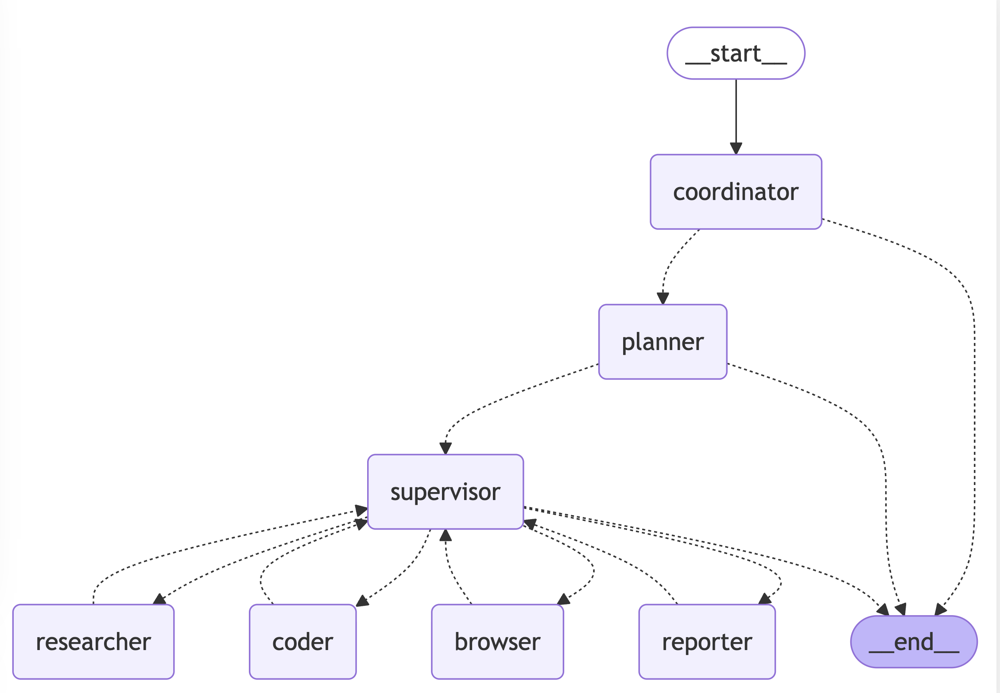

# Flowgen

[](https://www.python.org/downloads/)

## Demo

**Task**:

Calculate the influence index of DeepSeek R1 on HuggingFace. This index can be designed using a weighted sum of factors such as followers, downloads, and likes.

**Flowgen's Plan**:

1. Gather the latest information about "DeepSeek R1", "HuggingFace", and related topics through online searches.
2. Interact with a Chromium instance to visit the HuggingFace official website, search for "DeepSeek R1" and retrieve the latest data, including followers, likes, downloads, and other relevant metrics.
3. Find formulas for calculating model influence using search engines and web scraping.
4. Use Python to compute the influence index of DeepSeek R1 based on the collected data.
5. Present a comprehensive report to the user.



- [View on YouTube](https://youtu.be/sZCHqrQBUGk)

## Table of Contents

- [Quick Start](#quick-start)
- [Architecture](#architecture)
- [Features](#features)
- [Setup](#setup)
    - [Prerequisites](#prerequisites)
    - [Installation](#installation)
    - [Configuration](#configuration)
- [Usage](#usage)
- [Docker](#docker)
- [Web UI](#web-ui)
- [Development](#development)
- [FAQ](#faq)
- [Contributing](#contributing)
- [License](#license)
- [Acknowledgments](#acknowledgments)

## Quick Start

```bash
# Create and activate a virtual environment through uv
uv python install 3.12
uv venv --python 3.12
source .venv/bin/activate

# Install project dependencies
uv sync

# Playwright install to use Chromium for browser-use by default
uv run playwright install

# Configure environment
cp .env.example .env
# Edit .env with your API keys

# Run the project
uv run main.py
```

## Architecture

Flowgen implements a hierarchical multi-agent system where a supervisor coordinates specialized agents to accomplish complex tasks:



The system consists of the following agents working together:

1. **Coordinator** - The entry point that handles initial interactions and routes tasks
2. **Planner** - Analyzes tasks and creates execution strategies
3. **Supervisor** - Oversees and manages the execution of other agents
4. **Researcher** - Gathers and analyzes information
5. **Coder** - Handles code generation and modifications
6. **Browser** - Performs web browsing and information retrieval
7. **Reporter** - Generates reports and summaries of the workflow results

## Features

### Core Capabilities

- 🤖 **LLM Integration**
    - Integrates most models through [litellm](https://docs.litellm.ai/docs/providers). 
    - OpenAI-compatible API interface
    - Multi-tier LLM system for different task complexities

### Tools and Integrations

- 🔍 **Search and Retrieval**
    - Web search via Tavily API
    - Neural search with Jina
    - Advanced content extraction

### Development Features

- 🐍 **Python Integration**
    - Built-in Python REPL
    - Code execution environment
    - Package management with uv

### Workflow Management

- 📊 **Visualization and Control**
    - Workflow graph visualization
    - Multi-agent orchestration
    - Task delegation and monitoring

## Setup

### Prerequisites

- [uv](https://github.com/astral-sh/uv) package manager

### Configuration

Flowgen uses a three-layer LLM system, which are respectively used for reasoning, basic tasks, and vision-language tasks. Configuration is done using the `conf.yaml` file in the root directory of the project. You can copy `conf.yaml.example` to `conf.yaml` to start the configuration:
```bash
cp conf.yaml.example conf.yaml
```

You can create a .env file in the root directory of the project and configure the following environment variables. You can copy the.env.example file as a template to start:
```bash
cp .env.example .env
```

## Usage

To run Flowgen with default settings:

```bash
uv run main.py
```

### API Server

Flowgen provides a FastAPI-based API server with streaming support:

```bash
# Start the API server
make serve

# Or run directly
uv run server.py
```

The API server exposes the following endpoints:

- `POST /api/chat/stream`: Chat endpoint for LangGraph invoke with streaming support
    - Request body:
  ```json
  {
    "messages": [{ "role": "user", "content": "Your query here" }],
    "debug": false
  }
  ```
    - Returns a Server-Sent Events (SSE) stream with the agent's responses

### Advanced Configuration

Flowgen can be customized through various configuration files in the `src/config` directory:

- `env.py`: Configure LLM models, API keys, and base URLs
- `tools.py`: Adjust tool-specific settings (e.g., Tavily search results limit)
- `agents.py`: Modify team composition and agent system prompts

### Agent Prompts System

Flowgen uses a sophisticated prompting system in the `src/prompts` directory to define agent behaviors and responsibilities:

#### Core Agent Roles

- **Supervisor ([`src/prompts/supervisor.md`](src/prompts/supervisor.md))**: Coordinates the team and delegates tasks by analyzing requests and determining which specialist should handle them. Makes decisions about task completion and workflow transitions.

- **Researcher ([`src/prompts/researcher.md`](src/prompts/researcher.md))**: Specializes in information gathering through web searches and data collection. Uses Tavily search and web crawling capabilities while avoiding mathematical computations or file operations.

- **Coder ([`src/prompts/coder.md`](src/prompts/coder.md))**: Professional software engineer role focused on Python and bash scripting. Handles:

    - Python code execution and analysis
    - Shell command execution
    - Technical problem-solving and implementation

- **File Manager ([`src/prompts/file_manager.md`](src/prompts/file_manager.md))**: Handles all file system operations with a focus on properly formatting and saving content in markdown format.

- **Browser ([`src/prompts/browser.md`](src/prompts/browser.md))**: Web interaction specialist that handles:
    - Website navigation
    - Page interaction (clicking, typing, scrolling)
    - Content extraction from web pages

#### Prompt System Architecture

The prompts system uses a template engine ([`src/prompts/template.py`](src/prompts/template.py)) that:

- Loads role-specific markdown templates
- Handles variable substitution (e.g., current time, team member information)
- Formats system prompts for each agent

Each agent's prompt is defined in a separate markdown file, making it easy to modify behavior and responsibilities without changing the underlying code.

## Docker

Flowgen can be run in a Docker container.

Before run docker, you need to prepare environment variables in `.env` file.

```bash
docker build -t flowgen .
docker run --name flowgen -d --env-file .env -e CHROME_HEADLESS=True -p 8000:8000 flowgen
```

You can also just run the cli with docker.

```bash
docker build -t flowgen .
docker run --rm -it --env-file .env -e CHROME_HEADLESS=True flowgen uv run python main.py
```

## Web UI

Flowgen provides a default web UI.

Please refer to the [zpahuja/flowgeb-web](https://github.com/zpahuja/flowgen-web) project for more details.

## Docker Compose (include both backend and frontend)

Flowgen provides a docker-compose setup to easily run both the backend and frontend together:

```bash
# Start both backend and frontend
docker-compose up -d

# The backend will be available at http://localhost:8000
# The frontend will be available at http://localhost:3000, which could be accessed through web browser
```

This will:
1. Build and start the Flowgen backend container
2. Build and start the Flowgen web UI container
3. Connect them using a shared network

Make sure you have your `.env` file prepared with the necessary API keys before starting the services.

## Development

### Testing

Run the test suite:

```bash
# Run all tests
make test

# Run specific test file
pytest tests/integration/test_workflow.py

# Run with coverage
make coverage
```

### Code Quality

```bash
# Run linting
make lint

# Format code
make format
```